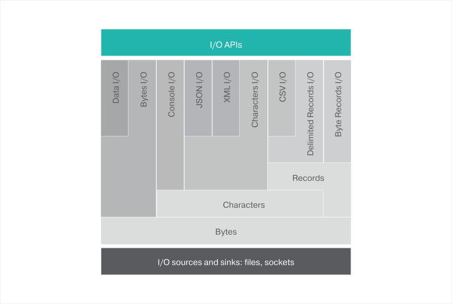

## Package Overview

This package is designed to support input and output operations via channels in a canonical way, either in a blocking,
or non-blocking manner.



### Channels
A channel represents an I/O source or sink of some bytes, characters, or records that are opened for reading, or
writing, respectively.
### Byte channels
The most primitive channel is the `ByteChannel` which reads and writes 8-bit bytes.

```ballerina
	// Open a file in read-write mode.
io:ByteChannel byteChannel = io:openFile("some/file.txt", io:RW);

// Read 100 bytes from the file.
var readResult = byteChannel.read(100);
    match readResult {
        (blob, int) content => {
            var (bytes, _) = content;
            return bytes; // Return the read bytes.
        }
    error err => {
        return err; // An IO error occurred when reading the bytes.
    }
}

// Write some content to the beginning of the file.
var content = "some content".toBlob("UTF-8");
var writeResult = byteChannel.write(content, 0);
match writeResult {
    int numberOfBytesWritten => {
        return numberOfBytesWritten; // Return the count of written bytes.
    }
    error err => {
        return err; // An IO error occurred when writing the bytes.
    }
}
```
### Character channels
The `CharacterChannel` is used to read and write characters. The charset encoding is specified when creating the
`CharacterChannel`.

 ```ballerina
// Create a `CharacterChannel` from the `ByteChannel`.
var charChannel = new io:CharacterChannel(byteChannel, "UTF-8");
```

If a `CharacterChannel` points to a JSON or XML source, it can be read and then written, directly into a variable of
the respective type.

```ballerina
// Reading a JSON.
var readResult = charChannel.readJson();
match readResult {
    json value => {
        return value; // Return the read JSON value.;
    }
    error err => {
        return err; // An IO error occurred when reading the JSON.
    }
}

// Writing a JSON.
json content = {fname:"Jhon", lname:"Doe", age:40};
var writeResult = charChannel.writeJson(content);
match writeResult {
    error err => {
        return err; // An IO error occurred when writing the JSON.
    }
}
```
```ballerina
// Reading an XML.
var result = charChannel.readXml();
```

### Record channels
Ballerina also supports I/O for delimited records.

```ballerina
// Creating a `DelimitedRecordChannel` from the `CharacterChannel`.
// Records are separated using a new line, and
// fields of a record are separated using a comma.
var recordsChannel = new io:DelimitedTextRecordChannel(charChannel, fs = ",", rs = "\n");

// Reading a few records.
while (recordsChannel.hasNext()) {
    var result = recordsChannel.getNext();
    match result {
        string[] record => {
            println(record); // Retrieved a record.
        }
        error err => {
            return err; // An IO error occurred when reading the records.
        }
        () => {
            error e = {message: "Record channel not initialized properly."};
            return e;
        }
    }
}
```

A `.CSV` file can be read and written directly into a `CSVChannel`, as shown in this code snippet.

```ballerina
var csvChannel = check io:openCsvFile("records.csv");
```

Records of the `.CSV` file can read directly into a table of a matching type.

 ```ballerina
// First let’s define a type that matches a record in the CSV file.
type Employee {
    string id;
    string name;
    float salary;
};

// Now read the CSV file as a table of Employees and compute total salary.
float totalSalary = 0;
match csvChannel.getTable(Employee) {
    table<Employee> employees => {
        foreach employee in employees {
            totalSalary += employee.salary;
        }
        return total; // Return total of salaries of all employees.
    }
    error err => {
        return err; // An IO error occurred when reading the records.
    }
}
```
## Package contents
